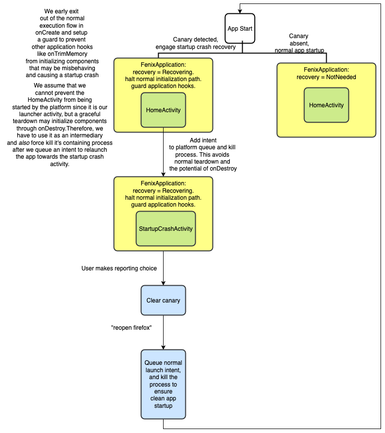

# Expected `StartupCrashActivity` behaviour

Fenix has a challenging problem: it’s possible for crashes to happen early in startup, especially in native components; and we want to collect crash reports for these startup crashes; but we also need user consent to collect said crash reports, necessitating UX to obtain consent and control the process.

This interacts with the regular startup lifecycle.  To accommodate, Fenix writes a “crash canary” early in startup.  If "early startup" completes successfully, the crash canary is removed.  However, if Fenix crashes during "early startup", the next Fenix launch will witness the crash canary still present from the previous invocation.  That’s our cue to display the StartupCrashActivity UX.

However, we have a challenge.  We want the StartupCrashActivity to be as minimal as possible so that it has the best chance to not itself crash. To achieve that, we prevent FenixApplication from entering its normal execution path in order to avoid initializing most components (including Gecko and application-services, the largest native-code components).

But this is fragile: there exist many execution paths that can initialize these components and systemic protections — for example, a separate Application class that initializes less — are not provided by the Android platform.  Therefore we are left carefully avoiding initialization, including in some surprising places, such as Android platform hooks like onTrimMemory. See current usages of FenixApplication.recoveryState. Generally, any overridden `Application` method carries risk of falling into this trap.

In addition, the Android platform launch process runs FenixApplication.onCreate and Fenix’s LAUNCHER intent, currently HomeActivity.  It is not currently easy to avoid launching HomeActivity (deterministically), and HomeActivity can also initialize various native-code components. Therefore we start HomeActivity but then immediately ask the Android platform to relaunch to the StartupCrashActivity, killing our own process (which might be contaminated) immediately.  Note that this death must be dirty, i.e., killing ourselves uncleanly is intentional: we avoid graceful teardown which risks HomeActivity::onDestroy instantiating components.

Finally, the StartupCrashActivity runtime environment is unusual: its FenixApplication has neutered its startup process.  For safety and simplicity, launch Fenix from the StartupCrashActivity must again happen in a fresh process, which will proceed (we hope!) through the regular FenixApplication.onCreate code path.

This diagram may help in visualize these considerations:

