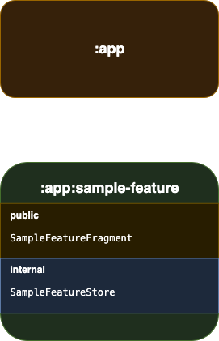

# How to create a new empty module in Fenix
If you are starting work on a new feature in Fenix, it's a good idea to make a new module for it.

Modularisation has many benefits which are [explained here](https://developer.android.com/topic/modularization).

This doc describes the process for creating a new module.

The main app module will depend on the feature module. 
The feature module exposes some code in a public interface, and the rest is encapsulated privately within it.


## Create a new folder for the module
This should go under [fenix/app](../../app).

If the new module name has spaces, replace them with dashes in the folder name: eg `sample feature` -> `fenix/app/sample-feature`

### Create module subfolders
The folder structure should look like this:
- [sample-feature](empty-module-template)
  - [src](empty-module-template/src)
    - [androidTest](empty-module-template/src/androidTest)
    - [main](empty-module-template/src/main)
    - [test](empty-module-template/src/test)

You can copy these folders from the [empty-module-template](empty-module-template) folder.

An empty `AndroidManifest.xml` file is provided, as well as a `build.gradle` file.

## Add namespace to gradle build file for the new module
- Open the [template empty build file](empty-module-template/build.gradle).
- Change the `samplefeature` namespace to match your new module name. 

This is the package name so can't contain dashes or spaces:

```groovy
android {
    namespace 'org.mozilla.fenix.samplefeature' // <-- Replace with your new module's package name    
    //...
}
```

## Add the new module into fenix gradle settings
In fenix's [settings.gradle](../../settings.gradle), find the bit where it says `include ':app'`:
```groovy
include ':app'
include ':app:sample-feature' // <-- Add this line, replacing samplefeature with your new module name 
include ':mozilla-detekt-rules'
include ':benchmark'
```
If you open Android Studio at the root dir of `fenix', you should now be able to see the new module in the build tree.

## Add the new module into top level gradle settings
This will allow Android Studio to pick up the new module if you open it at the top level of the monorepo.

In the firefox monorepo top level [settings.gradle](../../../../../settings.gradle), find the bit where it says `include ":fenix"`.

You will need to add in your new module and its `projectDir` here:

```groovy
if (!gradle.mozconfig.substs.MOZ_ANDROID_SUBPROJECT || gradle.mozconfig.substs.MOZ_ANDROID_SUBPROJECT == "fenix") {
    include ':fenix'
    project(':fenix').projectDir = new File("${gradle.mozconfig.topsrcdir}/mobile/android/fenix/app")
    
    // Add the following lines:
    include ':fenix:sample-feature'
    project(':fenix:sample-feature').projectDir = new File("${gradle.mozconfig.topsrcdir}/mobile/android/fenix/app/samplefeature")
}
```
You will need to do a gradle sync for Android Studio to pick up the new module (press the elephant button).

You are now ready to start coding! :tada:
